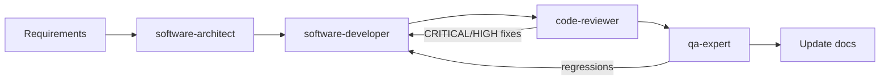

# Agent instructions

Kiribe Online uses role-based Claude agents in `.claude/agents/`.

## Pipeline

| Agent | Use when | Cursor `subagent_type` |
|-------|----------|------------------------|
| `software-architect` | Planning features, data models, API shape, caching strategy | `software-architect` |
| `software-developer` | Writing and fixing code | `software-developer` |
| `code-reviewer` | Security and quality review after changes (mandatory before merge on auth, forms, uploads, list APIs) | `code-reviewer` |
| `qa-expert` | Test plans and verification | `qa-expert` |

Start with [CLAUDE.md](./CLAUDE.md) and [docs/IMPLEMENTATION.md](./docs/IMPLEMENTATION.md).

## Memory

Topic files under `.claude/agent-memory/<role>/`:

| Role | Topic files |
|------|-------------|
| `software-architect` | `url-state-pagination.md` |
| `software-developer` | `query-hooks.md` |
| `code-reviewer` | `list-api-review.md`, `security-review.md` |
| `qa-expert` | `url-pagination-tests.md` |

Keep each role's `MEMORY.md` under 200 lines.

## Optional Cursor skills

- `review-security` — OWASP-focused diff review; does not replace `code-reviewer`
- `review-bugbot` — general diff review; does not replace `code-reviewer`
